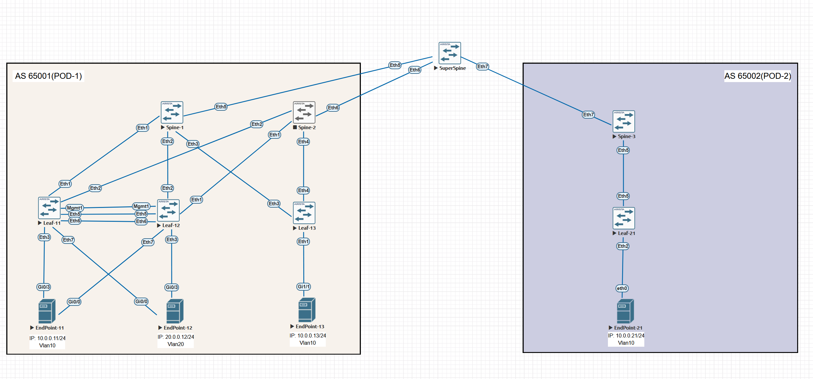
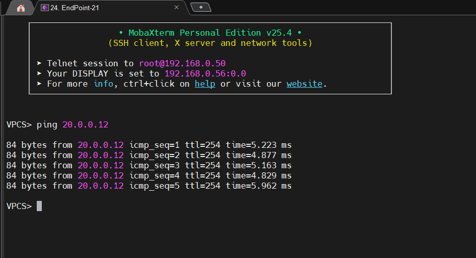
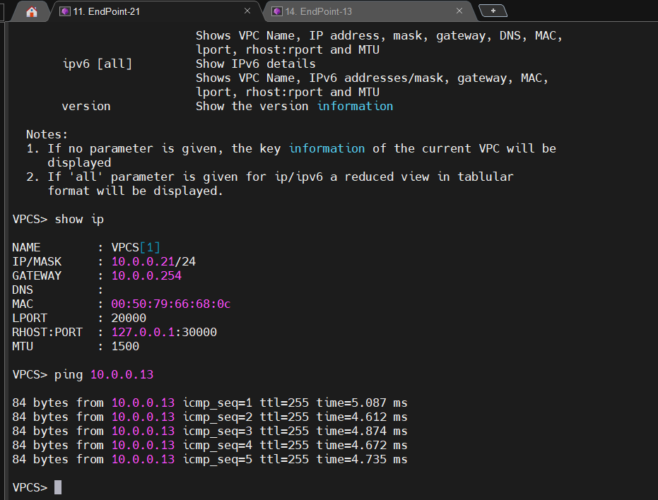

# VXLAN EVPN Multipod Fabric (Arista)

Проект развёртывания **VXLAN EVPN Multipod** на оборудовании Arista. Два географически распределённых POD-а объединены в общую L2/L3 фабрику через SuperSpine. Реализованы: Anycast Gateway, MLAG, межподовые VXLAN-туннели и L3 VNI для маршрутизации между VLAN.

## Схема сети



## Архитектура

- **Underlay**: OSPF (Area 0) между Leaf, Spine и SuperSpine. Каждый интерфейс — `/24` или `/30`, Loopback0 — VTEP source.
- **Overlay**: iBGP EVPN внутри каждого POD-а (Spine — route reflectors) и eBGP EVPN между POD-ами через SuperSpine.
- **Multipod**: SuperSpine (AS 65222) пересылает EVPN-маршруты между AS 65001 (POD-1) и AS 65002 (POD-2) без изменения next-hop.
- **MLAG**: Leaf-11 и Leaf-12 в POD-1 объединены в MLAG-домен (peer-link через VLAN 4094).
- **Anycast Gateway**: IP 10.0.0.254/24 и 20.0.0.254/24 присутствуют на всех Leaf (VRF `VRF_A_L3_VNI`).
- **VXLAN**:
  - VLAN 10 → VNI 10000 (L2)
  - VLAN 20 → VNI 20000 (L2)
  - L3 VNI 1001 для маршрутизации между VNI внутри VRF.


## Конфигурация (ключевые фрагменты)

### Underlay (OSPF + Loopback0)

```Arista
interface Loopback0
   ip address 11.11.11.11/32
   ip ospf area 0.0.0.0
interface Ethernet1
   no switchport
   ip address 172.1.3.11/24
   ip ospf area 0.0.0.0
```

## VXLAN и Anycast Gateway

```Arista
interface Vxlan1
   vxlan source-interface Loopback0
   vxlan vlan 10 vni 10000
   vxlan vlan 20 vni 20000
   vxlan vrf VRF_A_L3_VNI vni 1001
   vxlan flood vtep 13.13.13.13 21.21.21.21   ! статические VTEP для BUM
interface Vlan10
   vrf VRF_A_L3_VNI
   ip address virtual 10.0.0.254/24
```

BGP EVPN (iBGP внутри POD + eBGP на SuperSpine)

```Arista
router bgp 65001
   neighbor OVERLAY peer group
   neighbor OVERLAY remote-as 65001
   neighbor 111.111.111.111 peer group OVERLAY
   address-family evpn
      neighbor OVERLAY activate
   vrf VRF_A_L3_VNI
      rd 11.11.11.11:1001
      route-target import evpn 65001:1001
      route-target export evpn 65001:1001
```

На Spine-1/POD-1 добавлен eBGP к SuperSpine:

```Arista
neighbor 172.30.0.222 remote-as 65222
neighbor 172.30.0.222 ebgp-multihop 5
address-family evpn
   neighbor 172.30.0.222 route-map RM_BGP_NHU out
route-map RM_BGP_NHU permit 10
   set ip next-hop unchanged
```

Проверка работоспособности

L2-связность внутри POD-1


L2-связность между POD-1 и POD-2 (VLAN 10)
  
  



Основной функционал

- Растянутый L2 между площадками без STP
- IP-маршрутизация между VLAN через anycast-шлюз
- Отказоустойчивость: MLAG на доступе + ECMP в транспорте
- SuperSpine передаёт EVPN-маршруты без подмены next-hop — архитектура остаётся простой и прозрачной
